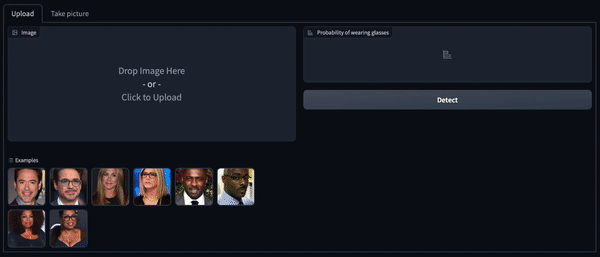

## Проект НИС MLP в ВШЭ

Участники: Бахматов Андрей, Корякин Алексей, Дмитрий Симонян, Герман Арутюнов, Сергей Хрущев, Владимир Морозов

Задача: определение наличия очков на фотографии

### Использование

Запуск инференса:

```shell
python main.py path/to/image/folder
```

Запуск инференса в докере:

```shell
docker build -t glasses . && docker run -v $(pwd)/demo_data:/app/demo_data -p 7860:7860 glasses
```

Затем откройте http://localhost:7860 в браузере. 
К сожалению, в докере не работает кеб-камера.
Решить проблемы можно [вот так](https://medium.com/@jijupax/connect-the-webcam-to-docker-on-mac-or-windows-51d894c44468), но это муторно.

Проще запустить локально:

```shell
python demo.py
```

gif-ка с примером работы:




### Для коллабораторов 

Фиксирование новых зависимостей (автоматически обновит requirements.txt):

```shell
pip freeze > requirements.in
pip-compile requirements.in
```